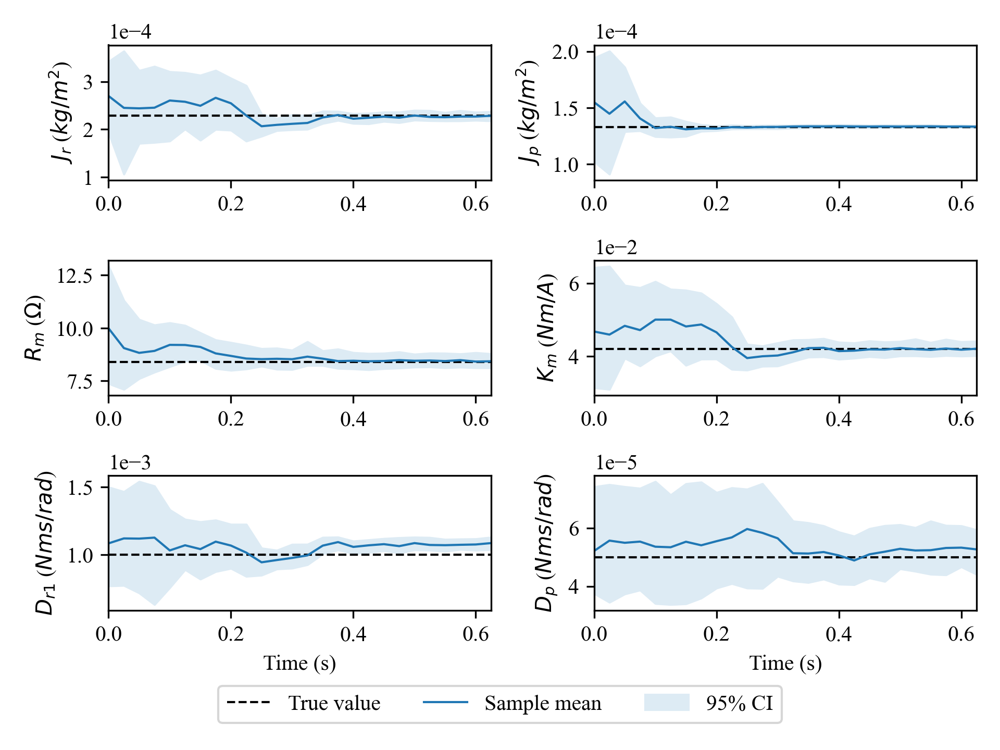

# Data to control: An approximate solution

Companion code to the paper 

Title: Data  to  Controller  for  Nonlinear  Systems:  An  Approximate  Solution

Authors: Johannes N. Hendriks, James R. Z. Holdsworth, Adrian G. Wills, Thomas B. Schön and Brett Ninness

Joint submission to the 2021 Control Design Conference and The IEEE Control Systems Letters.

## Paper Abstract

This paper considers the problem of determining an optimal control action based on observed data. 
We formulate the  problem  assuming  that  the  system  can  be  modelled  by  a nonlinear state-space model, 
but where the model parameters,state and future disturbances are not known and are treated as random variables. 
Central to our formulation is that the joint distribution  of  these  unknown  objects  is  conditioned  on  the
observed  data.  Crucially,  as  new  measurements  become  avail-able,  this  joint  distribution  continues  to  
evolve  so  that  control decisions are made accounting for uncertainty as evidenced in the data. 
The resulting problem is intractable which we obviate by  providing  approximations  that  result  in  finite  
dimensional deterministic optimisation problems. The proposed approach is demonstrated  in  simulation  on  a  nonlinear  system.
 
This git repository contains code to run the two simulations given in the paper and to plot the results. 
It also contains two additional simulation scripts.

## Simulation A) Pedagogical Example

Demonstrates the data to controller approach on a simulated non-control affine single state system with input and output constraints,
and student t distributed measurement noise. The system is given by


where w_t has a Gaussian distribution and e_t has a Student's T distribution.
A more detailed description of the simulation is given in the paper.

Presaved results corresponding to the plots shown in the paper can be plotted by running 

```
python plot_non_affine.py
```

Alternatively, a new simulation can be run (will then overwrite these results) using

```
python single_state_non_affine.py
```

Warning, if you do not have CUDA enabled JAX then this will take a long time to run and it is recommended you plot the 
presaved results.

### Results
States and control action over simulation
 

Estimated parameters (marginal distributions shown) over simulation
 

Forecast future states and optimised control action over the MPC control horizon
 

## Simulation B) Rotary Inverted Pendulum
Demonstrates the data to controller approach on a simulated rotary inverted pendulum system with input and output
constraints. 
This example has a mismatch between the damping model used for simulation and the model used for estimation. 
The continuous time dynamics are given by


For simulation the damping model


was used, and for estimation and control the damping model


to reflect that it is unlikely to know the true damping model. This system is discretised at 25ms intervals using an RK4 and
discrete time Gaussian process noise w_t is added. Measurements of the two angles and the supplied current are available given the 
measurement model


A more detailed description of the simulation is given in the paper.

Presaved results corresponding to the plots shown in the paper can be plotted by running 

```
python plot_pendulum_results.py
```

Alternatively, a new simulation can be run (will then overwrite these results) using

```
python inverted_pendulum_damping_mismatch_demo.py
```
Warning, if you do not have CUDA enabled JAX then this will take a very long time to run and it is recommended you plot the 
presaved results.

### Results

True and estimated states and control action over simulation
 

Parameter estimates over simulation (marginal distributions shown)
 

## Additonal simulations
An alternate version of the pedagogical example can be run using the command
```
python single_state_mpc_demo.py
```
This version of the pedagogical example is control affine and has Gaussian process and measurement noise. 
 The system is given by


where both w_t and e_t have Gaussian distributions.


Results can be plotted by running
```
python plot_single_state_demo.py
```

A version of the inverted pendulum example WITHOUT the mismatch in damping (linear damping model for simulation, estimation,
and control) can be run using
```
python inverted_pendulum_mpc_demo.py
```
The results can be plotted by changing the file to be loaded in the script 'plot_pendulum_results.py' setting
```
run = 'rotary_inverted_pendulum_demo_results'
```
 and then running the command
```
python plot_pendulum_results.py
```

## Requirements

A list of requirements is given in requirements.txt and can be installed by running the command 

```
pip install -r requirements.txt 
```

Note that this installs the CPU version of jaxlib, which will be adequate for plotting the results. However, if you would like
to rerun any of the simulations it is strongly recommended that you install CUDA, cuDNN, and the CUDA version of jaxlib. 
Some minimal instructions and additional resources for completing these installations is given below.


# Installing CUDA, cuDNN and jax/jaxlib on Linux

[Nvidia CUDA toolkit documentation and install links](https://developer.nvidia.com/cuda-toolkit-archive)

[Nvidia cuDNN download (requires Nvidia account)](https://developer.nvidia.com/CUDnn)

[Nvidia cuDNN install guide](https://docs.nvidia.com/deeplearning/cudnn/install-guide/)

[Jax install guide](https://github.com/google/jax#installation)

The instructions beyond here are specific to CUDA 11.1.0, cuDNN v8, and Python 3.8.6 on Ubuntu 20.04 LTS.

## Install prerequisites 
Remove the Nvidia proprietary driver if it is already installed. Install Python - this can be done by running `sudo apt install python3.8`, though it is usually already included. Check that `gcc` is installed with `gcc --version`. If not, install all of `build-essentials` via `sudo apt-get install build-essentials`. It may also be necessary to run `sudo apt-get install linux-headers-$(uname -r)` to ensure the correct kernel headers are installed.

## Install CUDA toolkit via runfile
To install CUDA using the runfile method first download the runfile after selecting a version from [this page](https://developer.nvidia.com/cuda-toolkit-archive) (the runfile is the same for all Linux distros). This command downloads 11.1.0:
```shell
wget https://developer.download.nvidia.com/compute/cuda/11.1.0/local_installers/cuda_11.1.0_455.23.05_linux.run
```
Do not run this file. Next, disable Nouveau (the open source Nvidia driver). To check if Nouveau is loaded or not, run `lsmod | grep nouveau` - no output means it is not loaded. To disable Nouveau on Ubuntu or Debian create this file: 
```shell
/etc/modprobe.d/blacklist-nouveau.conf
```
In the new file, write:
```shell
blacklist nouveau
options nouveau modeset=0
```
Then run:
```shell
sudo update-initramfs -u
```
After reboot there should be no output from `lsmod | grep nouveau`. 

Once Nouveau is disabled, reboot into console mode/text. For distros using `systemd` including Ubuntu >= 15.04 this can be achieved by running:
```shell
sudo systemctl set-default multi-user.target
```
After this is run, the command `systemctl get-default` should return `multi-user.target`. This will prevent the GUI from loading on boot. Reboot the computer.

After reboot, log in and navigate to the directory where the runfile was downloaded. Run the file, for the 11.1.0 file downloaded previously run:
```shell
sudo sh cuda_11.1.0_455.23.05_linux.run
```
After some time an EULA will appear. It may be poorly scaled, type `accept` and hit enter to accept the terms. The next menu should be some installation settings, the default settings are fine. Keep the samples selected as they are useful for validation. Start the installation.

After install these lines need to be added to `~/.bashrc` or equivalent. Run:
```shell
echo 'export PATH=/usr/local/cuda-11.1/bin${PATH:+:${PATH}}' >> ~/.bashrc
echo 'export LD_LIBRARY_PATH=/usr/local/cuda-11.1/lib64${LD_LIBRARY_PATH:+:${LD_LIBRARY_PATH}}' >> ~/.bashrc
```
Afterwards run `source ~/.bashrc`. The command `nvcc --version` should work and print the installed version. The install is complete. Restore the GUI by running:
```shell
sudo systemctl set-default graphical.target
```
And `sudo reboot`to reboot the computer.

There is some additional verification to do [here](https://docs.nvidia.com/cuda/archive/11.1.0/cuda-installation-guide-linux/index.html#verify-installation).

## Install cuDNN library via .tgz
Go to the [download site](https://developer.nvidia.com/CUDnn), log in, and choose cuDNN for 11.1, 11.1 and 11.2 and click on "cuDNN Library for Linux (x86_64)" to get a tarball. After that is downloaded unpack it:
```shell
tar -xzvf cudnn-x.x-linux-x64-v8.x.x.x.tgz
```
Replace the x's with the appropriate version numbers. In the unpacked directory, run: 
```shell
sudo cp cuda/include/cudnn*.h /usr/local/cuda/include 
sudo cp -P cuda/lib64/libcudnn* /usr/local/cuda/lib64 
sudo chmod a+r /usr/local/cuda/include/cudnn*.h /usr/local/cuda/lib64/libcudnn*
```

## Install Jax
```shell
pip install --upgrade pip
pip install --upgrade jax jaxlib==0.1.59+cuda111 -f https://storage.googleapis.com/jax-releases/jax_releases.html
```
Change `cuda111` to match the current CUDA version. At the [URL in the command](https://storage.googleapis.com/jax-releases/jax_releases.html) there is a list of available versions.